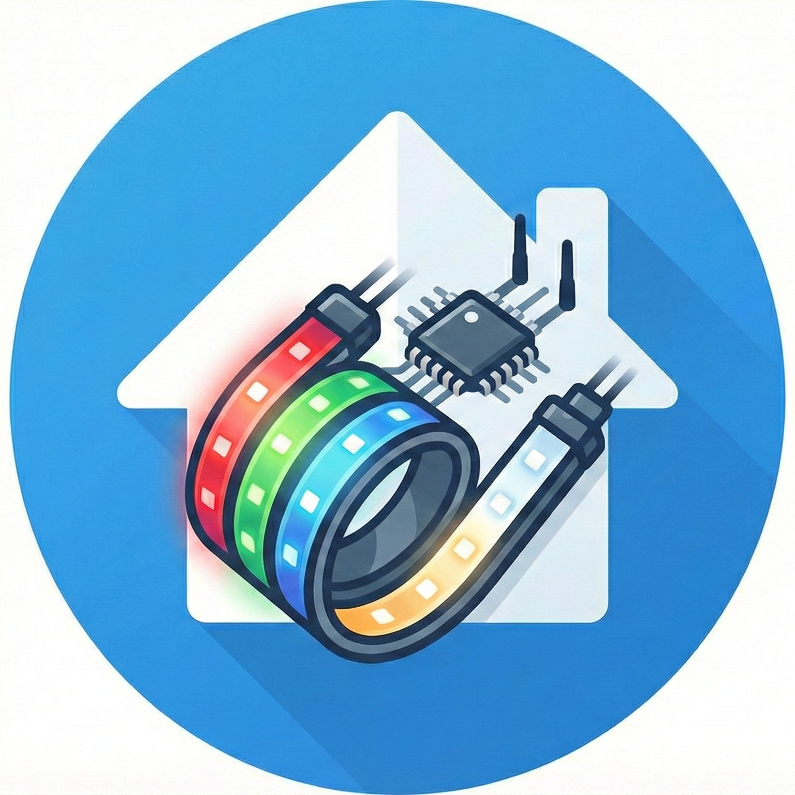

# FHEM RGBWW Controller for Home Assistant

A fully-featured custom integration to control your **FHEM RGBWW Controllers** directly from Home Assistant. 

### 📖 About the Hardware & Firmware
This integration is built for the awesome open-source [ESP RGBWW Controller](https://github.com/patrickjahns/esp_rgbww_controller) originally developed within the FHEM community around 2016. 

While there are multiple firmwares available for this hardware, **this integration specifically requires and supports the [vbs firmware](https://github.com/verybadsoldier/esp_rgbww_firmware)**. 
* 💬 [FHEM Community Forum Thread (vbs firmware)](https://forum.fhem.de/index.php?topic=70738.0)

---

This integration uses a highly responsive local TCP connection to communicate with your hardware, ensuring instant state updates without the need for polling. It goes beyond simple on/off commands, unlocking the full potential of your LED controllers with advanced hardware-level animations, unique color handling, and precise queue management.

---

## ✨ Features

* **Local Push Updates:** Uses a persistent TCP connection (Port 9090) to receive instant state changes directly from the controller.
* **Auto-Discovery Setup:** Built-in network scanner to easily find and add controllers on your local subnet (e.g., `192.168.1.0/24`).
* **Hardware Animations:** Send complex, multi-step color sequences directly to the hardware using standard YAML or a compact CLI syntax.
* **Queue Management:** Dedicated actions to pause, continue, or stop running animations on the controller.
* **Hardware Synchronization:** Exposes a `SyncOffset` sensor to monitor the clock synchronization status between multiple controllers.
* **Automation Triggers:** Built-in device triggers for when a hardware transition finishes (`transition_finished`).

---

## 🎨 Color Handling & UI Behavior

To fully utilize the hardware capabilities, this integration handles colors differently than standard Home Assistant light entities:

* **HSV + CT Focus in UI:** The standard Home Assistant light card will expose controls for **HSV** (Hue, Saturation, Brightness) alongside a **Color Temperature** slider.
* **Simultaneous Color & Temperature:** Unlike typical integrations where changing the color temperature switches the light into a mutually exclusive "White Mode," this integration treats Color Temperature as an additional parameter to the HSV color space. Moving the color temperature slider will affect the temperature of the active HSV mode rather than disabling the colors.
* **Raw 5-Channel Control (RGBWW):** The controller supports independent driving of all 5 hardware channels (Red, Green, Blue, Cold White, Warm White). While the standard UI uses the HSV+CT model for a cleaner user experience, you can execute raw 5-channel commands via the integration's dedicated `rgbww` custom actions.

---

## 📦 Installation

### Method 1: HACS (Recommended)
Because this integration is actively developed, you will first need to add it to HACS as a custom repository.

1. Open **HACS** in your Home Assistant interface.
2. Click the three dots in the top right corner and select **Custom repositories**.
3. Enter the URL of this repository (`https://github.com/verybadsoldier/homeassistant.fhem-rgbwwcontroller`) and select **Integration** as the category.
4. Click **Add**.
5. You can now search for **FHEM RGBWW Controller** in HACS and click **Download**.
6. Restart Home Assistant.

### Method 2: Manual Installation
If you prefer not to use HACS, you can install the files manually.

1. Download the latest release from this repository.
2. Copy the `custom_components/fhem_rgbwwcontroller` folder into your Home Assistant `custom_components` directory.
3. Restart Home Assistant.

---

## ⚙️ Configuration

Setting up the integration is done entirely via the Home Assistant user interface.

1. Go to **Settings** -> **Devices & Services**.
2. Click **+ Add Integration** in the bottom right corner.
3. Search for **FHEM RGBWW Controller**.
4. You will be presented with three options:
   * **Automatic discovery of controllers:** Scans a specified network range (e.g., `192.168.2.0/24`) to automatically find your devices.
   * **Add hostname or IP address manually:** Directly enter the IP address of your controller if you already know it.
   * **Add device from previous scan:** Quickly add more controllers if a previous scan found multiple devices.
5. Follow the on-screen prompts to name your device and assign it to an area.

---

## 🎛️ Provided Entities

Once configured, each controller will provide the following entities:

* **Light Entity (`light.*`):** The primary control for your LED strip. Supports turning on/off, brightness, color temperature, and color picking via the UI.
* **Sensor Entity (`sensor.*_syncoffset`):** Monitors the clock slave offset, allowing you to ensure multiple controllers are perfectly in sync for coordinated animations.

---

## 🚀 Advanced Usage & Actions

This integration really shines when used in automations. It provides dedicated actions to queue up animations, control hardware channels, and manipulate playback.

To keep this guide clean, the detailed syntax and examples for these advanced features are documented separately.

📚 **Please see the detailed documentation pages:**

* **[Actions](docs/actions.md):** How to use integrated actions.

* **[Animation CLI](docs/cli.md):** Learn how to write complex light sequences by using the CLI string syntax.

---

## 🐛 Troubleshooting

* **Device Unavailable:** Ensure the controller is powered on, connected to your Wi-Fi, and that Home Assistant can reach it via TCP port 9090 and HTTP.
* **Animations not playing:** Check your queue policy flags (`f`, `q`, `e`) in your action calls to ensure you aren't appending to a paused or stalled queue. 

---
*Created for the Home Assistant and FHEM community.*